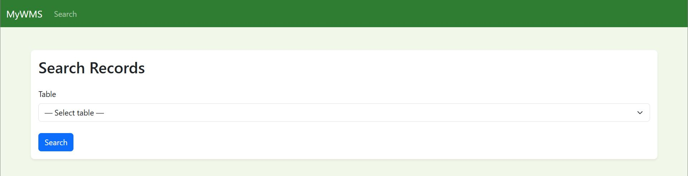
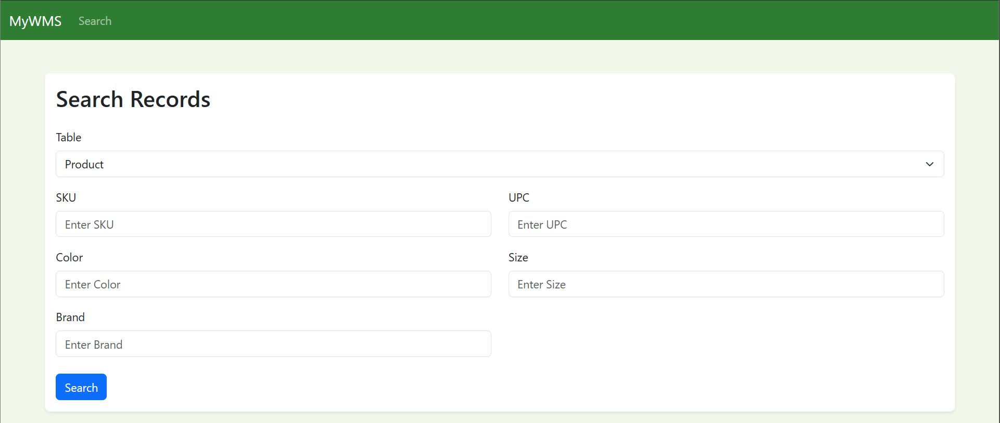
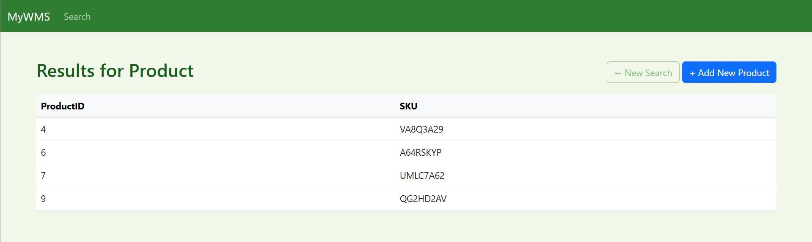
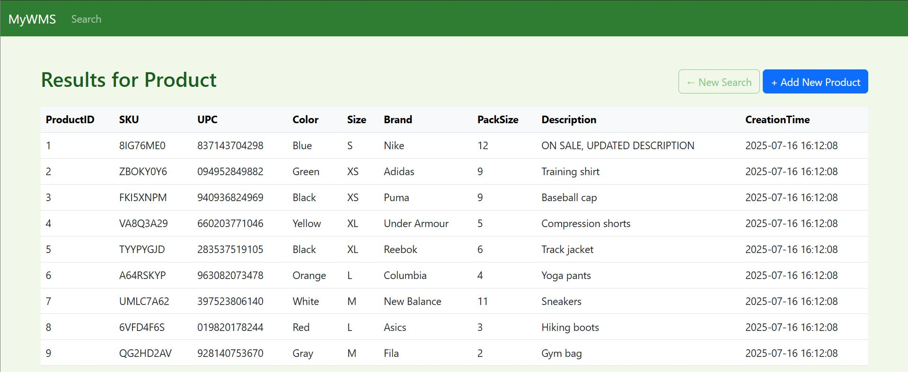
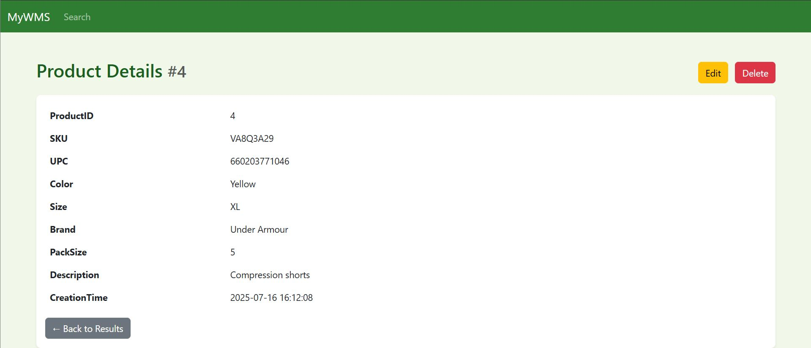
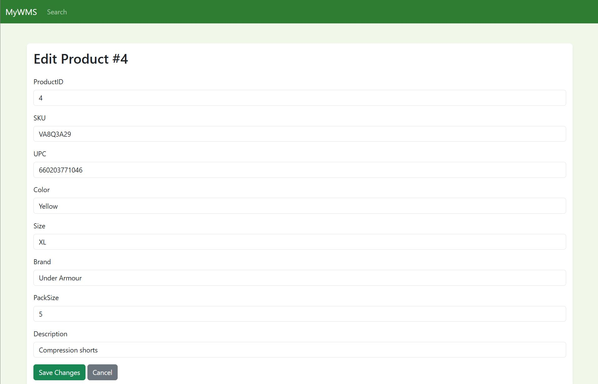

# COP4710-Semester-Project

## Overview

This project is a lightweight, PHP-based web application that demonstrates a Model-View-Controller (MVC) architecture for searching and managing an eCommerce catalog. It provides end-to-end CRUD (Create, Read, Update, Delete) functionality, secure user workflows, and a responsive front-end.

## Objective

- **Primary Goal**: Build a maintainable MVC system that allows users to search products, manage customer records, handle inventory, and process orders.
- **Key Deliverables**:
  - Full-text search across products and customers.
  - Secure add/update/delete operations for all entities.
  - Front-end and back-end validation to ensure data integrity.
  - Clear project structure to facilitate future enhancements.

## Skills Demonstrated

- **Backend Development**: PHP 7+, PDO for safe database interactions, password hashing and salting, REST-style routing.
- **Database Design**: MySQL schema design with normalized tables, relationships for orders, inventory history, and customer carts.
- **Front-End Development**: HTML5, CSS3 (including a custom `theme.css`), vanilla JavaScript for form validation, and Bootstrap classes for a responsive layout.
- **Architecture & Design Patterns**: MVC separation of concerns, single-responsibility models, reusable views, and controller dispatch patterns.
- **Version Control**: Git/GitHub for source management, feature branching, and pull-request workflow.


## Technologies Used

| Layer                   | Technologies                       |
| ----------------------- | ---------------------------------- |
| Server                  | Apache, PHP 7+                     |
| Database                | MySQL                              |
| Front-End               | HTML5, CSS3, Bootstrap, JavaScript |
| Tools                   | Git, GitHub, Composer              |
| Development Environment | VS Code, XAMPP                     |

## Installation & Setup

1. Clone the repository:
   ```bash
   git clone https://github.com/isaacjacques/COP4710-Semester-Project.git
   cd COP4710-Semester-Project
   ```
2. Install dependencies
   ```bash
   composer install
   ```
3. Run the SQL scripts in `sql/` to create and populate the database.
4. Configure database credentials in `config.php`.
5. Point your web server to the project’s `public/` directory.

## Demo

### Home Page



### Search Form



### Filtered Results



### Full Results



### Product Detail



### Edit Record



### Results for Product

